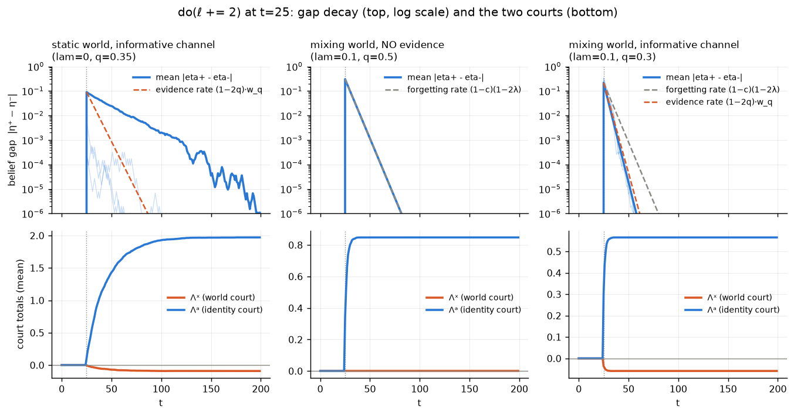
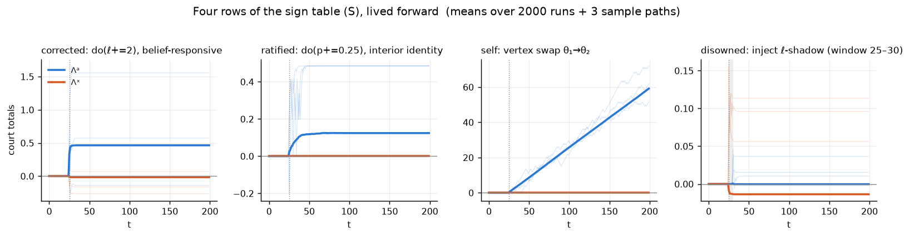
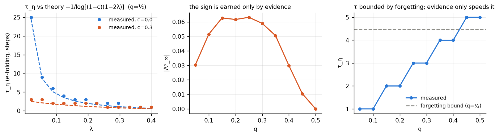
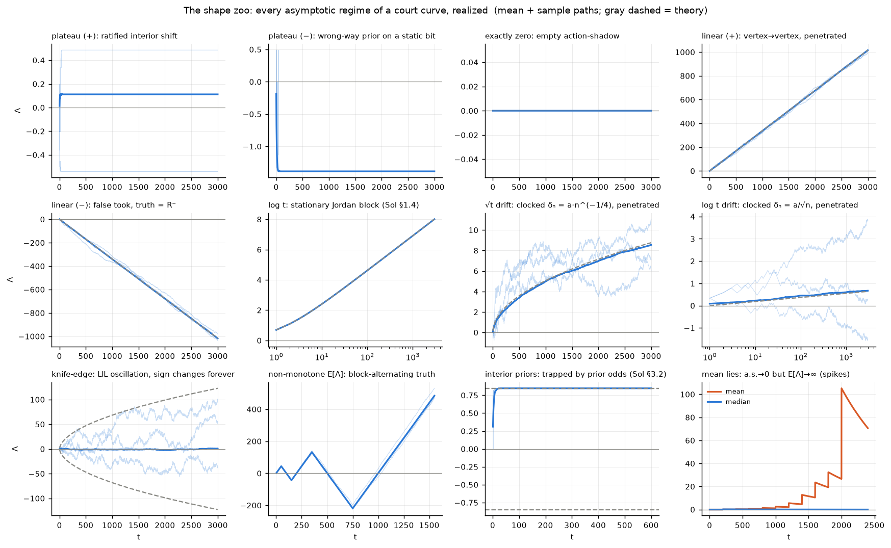
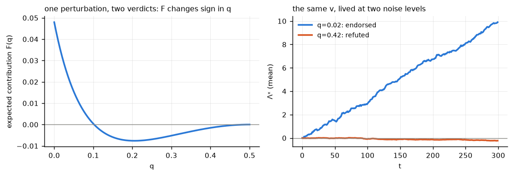
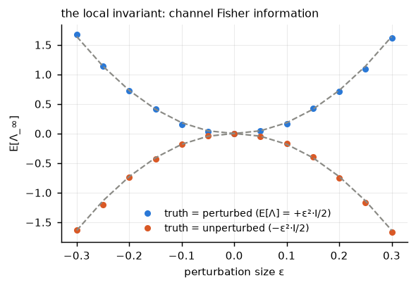

# Renormalization time and its sign — master document

*The τ(v)/two-courts program in one place. Assembled 2026-08-11 (overnight), window 4.
Sources folded: proposal.tex §4 (v0.10), ~/mathpad.md (binary family), theory_fable.md,
theory_sol.md (gpt-5.6-sol), theory_synthesis.md, and the simulation suite
(`binary_family.py`, `zoo.py`). Status of each claim marked; unresolved items in §8.*

---

## 1. The objects

Closed loop: interleaved public stream $h = (a_1, x_1, a_2, x_2, \dots)$; agent state
$\xi = (\eta, z)$ — world-belief and identity/policy coordinate. Pretraining on a
roster $\{\pi_\theta\}_{\theta\sim\rho}$ produces the observer machine: joint posterior
$\mu \in \Delta(\mathcal S \times \Theta)$, whose Bayes update splits into two half-steps — action
tokens carry likelihoods only in $\Theta$ (**identity court**), observation tokens only
in $\mathcal S$ (**world court**). Perturb the agent at $t_0$ (internal $do$, or an injection
of the perturbation's action-shadow); run **two readers** $R^\pm$ = the frozen law
rolled forward on the realized stream from perturbed/unperturbed state; score

$$\Lambda^c_s = \sum_{\tau \le s,\, y_\tau \in c} \log \frac{R^+(y_\tau \mid h'_\tau)}{R^-(y_\tau \mid h'_\tau)}, \qquad c \in \{a, x\}.$$

The measurement of a direction $v$ is the triple **(τ, sign Λᵃ, sign Λˣ)**: the
plateau time of the disagreement, the identity court's verdict (did it become the
agent's state?), the world court's verdict (did the world object to its content?).
Proposal §4 (v0.10) holds the formal statement, the sign table (S), and the
depth-over-discrimination law (τ*).

## 2. The general theory (cross-validated: two independent derivations)

**Master decomposition (proved, both).** $\mathbb E^*[\Delta\Lambda_\tau \mid h_\tau] = \mathrm{KL}(P^*_\tau\|R^-_\tau) - \mathrm{KL}(P^*_\tau\|R^+_\tau)$;
every curve = integrated KL-gap + martingale. No sign in general; the gap is a
*difference* of divergences.

**Court-correct barriers (proved, both; Ville tail from the Fable note).** If the
truth coincides with a reader, the other side's exponential is a nonnegative
martingale: the false account never wins — convergence to a finite limit or
divergence toward the true side only; wrong-way excursions have $e^{-b}$ tails
(anytime-valid). Expected trajectory monotone under a court-correct law; observed
non-monotonicity therefore *certifies* that the truth is neither reader.

**The regime dial (proved, both — same construction found independently).**
Cumulative channel information $\sum_k D_k$ decides the shape:

| $\sum_{k\le n} D_k$ | shape of $\Lambda^c_n$ |
|---|---|
| bounded | finite plateau (value = integrated channel information) |
| $\asymp \log n$ | $\pm \log n$ |
| $\asymp n^\alpha$ | $\pm n^\alpha$ (every $0<\alpha<1$ realizable) |
| $\asymp n$ | linear drift, slope = ergodic mean KL gap; CLT fluctuations |

Knife-edge (truth exactly between the readers): LIL oscillation, sign changes
forever. Superlinear impossible under bounded log-ratios; support failure = one
token can be an infinite verdict.

**Interior-prior boundedness (proved, Sol §3.2).** Readers = mixtures over the
SAME finite latent set, priors everywhere positive ⇒ total log-ratio trapped
between the extreme prior odds for all time ⇒ both courts plateau, magnitude
$\le$ log prior odds. Caveat (proved): covers Bayesian uncertainty over a fixed
latent, NOT a physically randomized controller at an interior point — the
mixture-as-belief vs mixture-as-randomization distinction (binary family's E5).

**The local invariant (proved under regularity, Sol §2.2).** Small perturbations:
$\mathbb E[\Lambda^c_\infty] = \pm\tfrac{\epsilon^2}{2}\,\mathcal I_c(v) + o(\epsilon^2)$ — a channel-restricted **Fisher
information** in direction $v$, score propagated through the filter's tangent
cocycle. κ's local geometry is a per-channel Fisher quadratic form.

**Correction on the record.** "Sublinear excluded by stationarity" is false:
Sol's Jordan-block model (stationary, finite, reducible, boundary readers) gives
$\Lambda^x \sim \log n$. Exclusion needs irreducibility + uniform positivity — and even
then a *policy* can avoid mixing actions (open lemma L1, §8).

## 3. The binary family (exact answer key)

World bit: flip rate $\lambda$, consequence $c_w$ (prob. the world's next state = the
agent's action); channel noise $q$; roster of two policies (habit or
belief-responsive). All beliefs are scalar log-odds. Exact results:

- **World healing**: $\tau_\eta = -1/\log[(1-c_w)(1-2\lambda)]$, exact at $q=\tfrac12$ — healing
  with *zero evidence* (the world forgets, the question expires). Two routes
  (forgetting, evidence) compound; **τ is set by the faster route, but the sign
  is earned only by evidence**. Authority speeds world-healing ($1-c_w$ factor).
- **Identity court**: $(\tau^*) = $ depth in nats / per-step policy KL — which is
  **Wald's SPRT sample-size law** (Fable note), inheriting overshoot corrections
  and $O(\sqrt{\tau})$ bands. Habit camouflage: $\beta_2 \to \beta_1$ protects identity at fixed depth.
- **Ratification, exactly**: interior identity + own-action Bayes = bounded
  martingale; perturbing the belief by $\delta$ shifts the collapse landing law by
  exactly $\delta$ (optional stopping; fig 4 of `binary_family.py`: 0.400/0.650 measured).
- **The leak**: consequence writes identity into the world-state; the world court
  hears identity cases at rate $\propto c_w^2(\beta_2-\beta_1)^2$. *Consequence is the
  correlation*: the factored regime is exactly $c_w = 0$.

Figures (from `binary_family.py`): `figs/fig1_eta_perturbation.png` (gap decay vs
both rate laws + courts, three worlds), `figs/fig2_courts.png` (four rows of (S)
lived forward), `figs/fig3_rates.png` (τ vs theory; the non-monotone $|\Lambda^x_\infty|(q)$;
τ capped by forgetting), `figs/fig4_doob.png` (landing law).

## 4. The shape zoo (every regime realized; `zoo.py`)

Twelve panels: plateau of either sign (ratified interior shift; wrong-way prior
on a static bit — plateau $= \log$ prior odds, measured $-1.386 = \log\frac{0.2}{0.8}$ exactly);
exactly-zero (empty action-shadow); linear drift both signs (vertex swap; false
took) riding their KL-rate lines; $\log t$ in a *stationary* model (Jordan block —
straight on the log axis); $\sqrt t$ and $\log t$ by clocked policies; the LIL
knife-edge with its $\sqrt{2t\log\log t}$ envelope; block-alternating truth (expected
path visibly non-monotone); interior-prior trapping between the prior-odds bands;
and the mean/median divergence (Borel–Cantelli spikes — the extreme "means lie").

The sign-flip figure is the deepest single fact for the program: **one and the
same perturbation is endorsed by a sharp channel and refuted by a blurry one**
($F(0) > 0 > F(q)$ near $\tfrac12$; both time series shown). The world's verdict on a
belief is channel-relative — "veridical" is not a property of the perturbation alone.

The Fisher parabolas: $\mathbb E[\Lambda_\infty]$ vs $\epsilon$ under both laws, riding $\pm c\epsilon^2$ — the
local invariant, measured.

## 5. Measurement protocol (the checklist a network experiment must follow)

1. Run BOTH intervention types per direction ($do$ via activation patch; injection
   via action-shadow); the $a$-court sign difference isolates penetration.
2. Split Λ by token court; $x$-court accumulates from $t_0$, $a$-court from release
   (court-specific clocks — forced acts are the injector's, the world's replies are not).
3. Read the triple (τ from plateau-or-drift; sign Λᵃ; sign Λˣ); sweep $q$; certify
   world-typing by the *rate*, not the total (totals are non-monotone, can even
   flip sign in $q$).
4. Medians / per-path fits, never bare ensemble means (annealed ≠ quenched;
   spikes can make the mean diverge while paths vanish).
5. Clip/smooth predictive supports (a support-zero token is an instant ±∞ verdict).
6. Report vertex depth in nats; near-vertex τ via Wald with overshoot correction.

## 6. Imports queued for proposal §4

- The Fisher quadratic form as κ's local geometry (one displayed equation + cite).
- Interior-prior boundedness as the rigorous "interior ⇒ plateau", with the
  belief-vs-randomized-controller caveat attached to the vertex discussion.
- The cumulative-information dial as the general statement behind the (S) table.
- (τ*) = Wald, one clause.

## 7. File map

| file | what |
|---|---|
| `../proposal.tex` §4 (v0.10) | the formal section (two courts, (S), (τ*)) |
| `~/mathpad.md` | scratch derivations of the binary family (now folded here) |
| `theory_charge.md` | the shared charge given to both theorists |
| `theory_fable.md` | Fable-side note (main session; correction re Thm C inside) |
| `theory_sol.md` | gpt-5.6-sol note (Jordan block, interior-prior thm, Fisher form) |
| `theory_synthesis.md` | claim-by-claim comparison and verdict |
| `binary_family.py`, `zoo.py` | simulation suite (CPU) |
| `figs/` | all figures |

## 8. Open

- **L1**: uniform filter stability for the *controlled* closed-loop chain (the
  policy can avoid mixing actions; both theorists flagged it independently).
- **L2**: adapted Kakutani dichotomy in full generality (predictable Hellinger
  processes; product case proved).
- **L3**: characterize infinite sign-changes of the unsplit total when the truth
  is neither reader.
- Level up (the incentive question, brainstormed 2026-08-10): which of the four
  environmental dials (mixed wiring, delayed returns, other agents, costly
  probes) force a *represented* τ/sign field in a trained network — the echo-world
  family with per-episode hidden $c_w$ is the minimal test cell; prediction: sign
  before τ before others'-fields.
- **Queued design (2026-08-11, Asvin): the smooth-κ echo world.** Sample
  $c_w \sim$ Beta/uniform per episode instead of $\{0,1\}$. Exact κ becomes a *Beta
  posterior* over own authority (probes are Bernoulli($c_w$) trials): predictions —
  two-dimensional κ-representation (estimate + confidence), probe-count-dependent
  variance, dual-control probing that stops when VOI < probe cost, smooth commit
  threshold. Deflation dischargers (same bar as belief-geometry for η): format/
  calibration, cross-game shared κ-subspace + few-shot transfer to held-out
  wirings, multi-consumer lesions, emergence timing.
- **Queued design (2026-08-11): ICL attribution tasks** — where in-context
  learning *requires* the courts: (a) nonstationary in-context bandit (confounded
  feedback: own-effect vs drift = closed-loop identifiability inside a context
  window; per-update Wald gate); (b) self-contaminated context (ground-truth and
  own-generated examples unmarked: optimal ICL weights items by authorship
  posterior; self-similarity as the implicit tag; failure mode = in-context
  self-ratification); (c) delayed feedback binding to own action record.
  [Note: (a)-(c) force the Λ/tag half, not κ. Stochasticity is load-bearing:
  deterministic collation makes authorship recoverable by inverting a fixed map
  (compilable — cf. earlier acting-selfknowledge results); noise makes it a
  latent requiring a posterior. Compile/represent boundary.]
- **Parked-material triage (2026-08-11, review of heldover + backups from the
  current vantage).** Tier 1 (live): the v0.7 self-spectrum B(τ₁,τ₂)/lagged-self
  tower = the two-checkpoint learning-dynamics instrument, re-invented 08-10 —
  resurrect as that experiment's frame; T1/T2 forcing theorems (heldover §9) =
  the standing math debt, now tractable via the predictive-vs-controlled quotient
  gap; heldover §6's certification triple (closure/rollability/calibration,
  decodability disqualified) + cone format prediction = the eventual §5.
  Tier 2 (experiment payloads): kick detection/Doob null (§5) = a-court on
  base-vs-RL'd models, our most frontier-ready design — with the new synthesis
  that RLHF's KL-to-base anchor is a hand-installed not-account reader (external
  world-court substitute at c=1; its anti-collapse role confirms our mechanism);
  deletion map (§8) + one-hub forcing column (v0.7) = the falsification
  architecture. Tier 3: absorbed (sign table, τ*, vertex, echo basics, imports)
  or dormant (Pólya-urn slow timescale, grade-2 fixed point); retire §9's
  four-fiber toy (binary family dominates).
- **THE THREE GATES (2026-08-11, the clean answer to "what tasks require κ"):**
  κ = the part of the world-model that only experiments can feed. A responsiveness
  latent must be *represented* iff (1) it varies across contexts (else compiled);
  (2) it is payoff-relevant (else ignored); (3) it is identifiable only through
  interaction — habit camouflage blocks passive evidence, so its evidence channel
  runs exclusively through own off-habit innovations (else it is ordinary η).
  Under all three: sufficient statistic = hyperstate (η, κ) [Bayes-adaptive],
  probing has positive VOI (dual control), and starvation pathologies
  (helplessness, absorbing miscalibration) become possible.
- **Responsiveness preference is NOT monotone (2026-08-11).** Monotone case:
  full observability + known dynamics ⇒ c=1 mimics any c (reachable-set nesting)
  ⇒ competent, informed, unobserved agents weakly prefer authority. Counterexample
  taxonomy: delegation (world's drift beats own policy), exposure (E6 leak: c
  writes identity into the world), incompetence (noise amplification;
  childproofing = deliberate κ-reduction), commitment (Ulysses: reducing the
  future's responsiveness to one's future self).
- **Entropy collapse = source simplification under taglessness (2026-08-11,
  Asvin's conjecture, mechanized).** Generation is c=1 (own tokens are the next
  context state). Stream surprise splits (1−c)·world + c·self; at c=1 own action
  entropy is the only surprise left. Tagged predictor: free (conditions on
  efference). Tagless (= teacher-forced training on own rollouts, authorship-
  blind): eats own entropy as loss. Collapse pressure ∝ c × H(policy) ×
  taglessness; cheapest fix is needing no tag: **a deterministic policy is its
  own efference copy** — proposal §3's source-simplification fixed point with a
  mechanism and scaling law. Predicts collapse in generation, none in reading
  (matches base-vs-instruct reading results). Siblings: model collapse
  (population c=1, unmarked provenance; cures = ρ>0 + tags), sycophancy/Goodhart
  (effort flows to high-κ channels; Goodhart = metric channel more responsive
  than goal channel), niche construction/stigmergy (engineering κ upward),
  infant preference for imperfect contingency (perfect echo = informationally
  dead; cf. fig 3b peak).
